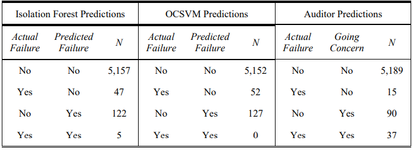
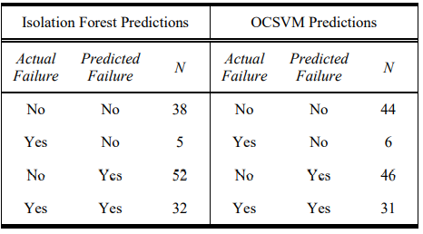

```{r setup, include=FALSE}
  
knitr::opts_chunk$set(echo = FALSE)
```

## Genesis

-   This project began at UARK
-   Got a grant
-   It has changed quite a bit

## Research Objectives

-   Examine auditors' behavior of issuing going concerns during and after the financial crisis
-   Examine how machine learning model predictions compare to auditors going concern issuance
-   Examine if combining expertise with machine learning increasing accuracy of prediction

## Prior Research - Bank & GC

-   Bank failures have negative consequences

-   Regulatory agencies called for action

    -   Dodd-Frank

    -   FDIC - adjusted CAMELS

-   GC can be more severe for banks

## Predicting Bank Failure

```{=html}
<details><summary>Meyer and Pifer (1970)</summary><p>

```
-   Small sample: Training 30 and Testing 9
-   Matched Sample
-   1948 - 1965
-   Ordinary Least Squares: LPM
```{=html}
</p></details>

```


<details>

<summary>

Thomson (1991)

</summary>

<p>

-   Predicts 1, 2 , 3 years ahead with 1 year of training data
-   1982-1989
-   Logistic Regression

</p>

</details>

<details>

<summary>

Wheelock and Wilson (2005)

</summary>

<p>

-   Association study
-   1987-1999
-   Cox Proportional Hazard Model

</p>

</details>

<details>

<summary>

Estrella, Park, and Perstiani (2000)

</summary>

<p>

-   Association study
-   1988-1993
-   Cox Proportional Hazard Model and Logistic (by year)

</p>

</details>

<details>

<summary>

Cole and White (2012)

</summary>

<p>

-   Association and Prediction Training 2008-2009 and Testing q1-q3 in 2010
-   2004-2009
-   Logistic Regression

</p>

</details>

<details>

<summary>

Ng and Roychowdhury (2014)

</summary>

<p>

-   Association
-   2001-2010
-   Logistic Regression and Hazard models

</p>

</details>

<details>

<summary>

Kosimidou and Zopounidis (2008)

</summary>

<p>

-   Training 1993-1999 and Testing 2000-2003
-   Discriminant analysis and UTADIS
-   Matched samples

</p>

</details>

Not an exhaustive list

## Prior Research Issues

-   Quarterly
-   Association
-   Matched sample
-   Reports true positive rate as accuracy

## Research Method Overview

-   Training sample starts 2003 and the testing sample ends in 2019

-   Rolling 3 year windows

-   Predict Bank Failures

-   Sample has auditor, bank, and return information

## GC and Bank Failures

```{r Byyear, echo=FALSE,message=FALSE,warning=FALSE,fig.align='center',out.width="80%"}
library(tidyverse)

load("gc_bf_by_year.Rda")

ggplot(df,aes(x=fyear,y=value, fill=variable)) + 
  scale_fill_manual(values = c("Failure" = "darkgrey", "Going_Concern" = "darkred")) +
  geom_bar(stat='identity', position='dodge')+
  scale_x_continuous(labels=as.character(df$fyear),breaks=df$fyear)+
  theme(axis.text.x = element_text(angle = 90, vjust = 0.5, hjust=1))+
  xlab("Fiscal Year") +
  ylab("Frequency") +
  ggtitle("Frequency Table") +
  theme(plot.title = element_text(hjust = 0.5))

  

```

## GC and Bank Failures

```{r byyear,echo=FALSE,message=FALSE,warning=FALSE}
library(knitr)
library(kableExtra)
load("GCFail.Rda")
library(sjPlot)
       kable(GCFail,
             label = "Table 1: Frequency",
             col.names = c('Fiscal Year','Bank Failure','Going Concern'),
             align = "c")%>%
             scroll_box(width = "50%", height = "70%")%>%
             kable_styling(c("striped", "bordered"),font_size = 12) 

```

## Hypothesis 1

**H1**: *Regulatory and market scrutiny had no effect on the auditors' propensity to issue a going concern after the financial crisis relative to during crisis.*

## H1 Confusion During

```{r ,echo=FALSE,message=FALSE,warning=FALSE,fig.align='center',out.width="60%"}

load("DuringGCConfusion.Rda")

ConfusionTableR::binary_visualiseR(train_labels = factor(DuringGCConfusion$GOING_CONCERN),
                                   truth_labels= factor(DuringGCConfusion$Target),
                                   class_label1 = "Bank Failure", 
                                   class_label2 = "Going Concern",
                                   quadrant_col1 = "#5D1725", 
                                   quadrant_col2 = "#777777", 
                                   custom_title = "During Going Concern Confusion Matrix", 
                                   text_col= "black")

```

## H1 Confusion Post

```{r ,echo=FALSE,message=FALSE,warning=FALSE,fig.align='center',out.width="60%"}

load("PostGCConfusion.Rda")

ConfusionTableR::binary_visualiseR(train_labels = factor(PostGCConfusion$GOING_CONCERN),
                                   truth_labels= factor(PostGCConfusion$Target),
                                   class_label1 = "Bank Failure", 
                                   class_label2 = "Going Concern",
                                   quadrant_col1 = "#5D1725", 
                                   quadrant_col2 = "#777777", 
                                   custom_title = "Post Going Concern Confusion Matrix", 
                                   text_col= "black")
```

## Hypothesis 1 Results

```{r,echo=FALSE,message=FALSE,warning=FALSE}
library(knitr)
library(kableExtra)
load("GC_BFcrisis.Rda")
load("GC_BFpostcrisis.Rda")

       kable(GC_BFcrisis,
             label = "Going Concern During Crisis",
             #col.names = c('Fiscal Year','Bank Failure','Going Concern'),
             align = "c")%>%
             #scroll_box(width = "50%", height = "70%")%>%
             kable_styling(c("striped", "bordered"),font_size = 12,
                           full_width = F, position = "float_right") 
       kable(GC_BFpostcrisis,
             label = "Going Concern Post Crisis",
             #col.names = c('Fiscal Year','Bank Failure','Going Concern'),
             align = "c")%>%
             #scroll_box(width = "50%", height = "70%")%>%
             kable_styling(c("striped", "bordered"),font_size = 12,
                           full_width = F, position = "float_left")
       
       
      
```

## H1 Test of Significance

```{r, echo=TRUE,message=FALSE,warning=FALSE}
prop.test(x=c(47,80), n=c(1830+14+20+27, 3359+1+70+10),
          conf.level=0.9)

```

## H1 Test of Significance

```{r,echo=TRUE,message=FALSE,warning=FALSE}
prop.test(x=c(20,70), n=c(1830+14+20+27, 3359+1+70+10),
          conf.level=0.99)

```

## Unsupervised Learning

Models learn with only one class, the banks that do not fail. Bank failure is an anomaly. Anomalies should not be view as a percentage of the sample. For the first part of our sample traditional models cannot be used.

## Isolation Forest

-   Ensemble of decision trees
-   Random sample and input
-   Continues until each point is isolated
-   Prediction: deeper the observation more likely an anomaly

## One-Class Support Vector Machine

-   Like a normal support vector machine except the origin is a class

-   Separate two classes with a hyperplane

-   Kernel for non-linearity

-   svm points and error

## Hypothesis 2

**H2**: *Bank failure prediction accuracy is similar between auditors and machine learning methods.*

{width="80%"}

## Hypothesis 3

**H3**: *Combining auditor and machine learning bank failure predictions improves going concern opinion false positive rate.*

{width="70%"}

## Conclusion

1.  Anomaly Detection

2.  Auditors do a good job

3.  Auditors with ML can do a better job

## Additional Analysis

-   Two modules perform similarly

-   Bailouts not an issue

-   Distress only similar, but less false positives

-   GC in the model does not help

## Difference in Means

```{r desc, echo=FALSE,message=FALSE,warning=FALSE}
library(knitr)
library(kableExtra)
load("DifferenceInMeans.Rda")
library(sjPlot)
       kable(DifferenceInMeans,
             label = "Difference in Means",
             #col.names = c(),
             align = "c")%>%
             scroll_box(width = "70%", height = "70%")%>%
             kable_styling(c("striped"),font_size = 12) 

```

## Paper

<object data="DHHR Draft 20211019.pdf" type="application/pdf" width="100%" height="70%">

</object>

## Test

This is an example of toggle buttons
```{=html}
<script type="text/javascript">
   function toggle_visibility(id) {
       var e = document.getElementById(id);
       if(e.style.display == 'block')
          e.style.display = 'none';
       else
          e.style.display = 'block';
   }
</script>
```


```{=html}
<button onclick="toggle_visibility('myDiv1');">I am 1</button>

```

::: {#myDiv1}
Goes with 1
:::


```{=html}
<button onclick="toggle_visibility('myDiv2');">I am 2</button>
```
::: {#myDiv2}
Goes with 2
:::

